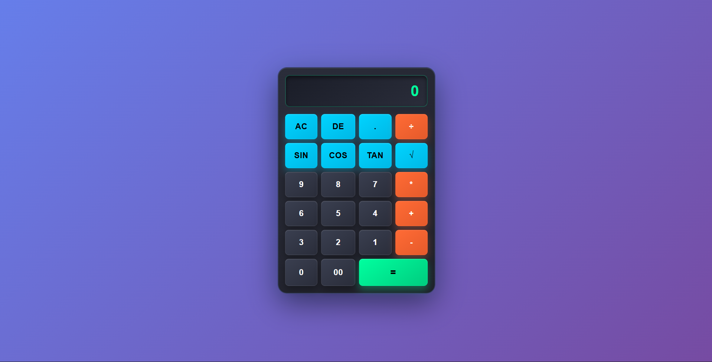

# Calculator App

A simple calculator web app that performs basic arithmetic operations in real time.

## About

This is a browser-based calculator built using HTML, CSS, and JavaScript.  
Users can perform basic operations like addition, subtraction, multiplication, and division with instant results.  
I built this project to practice handling user input, implementing calculation logic, and updating the UI dynamically using JavaScript.

## Built With

`HTML` `CSS` `JavaScript`

## What I Learned

- How to manage calculator state and perform arithmetic operations based on user interactions.

## Links

- [Live Demo](https://snehashrestha123.github.io/Calculator/)
- [Source Code](https://github.com/Snehashrestha123/Calculator)
